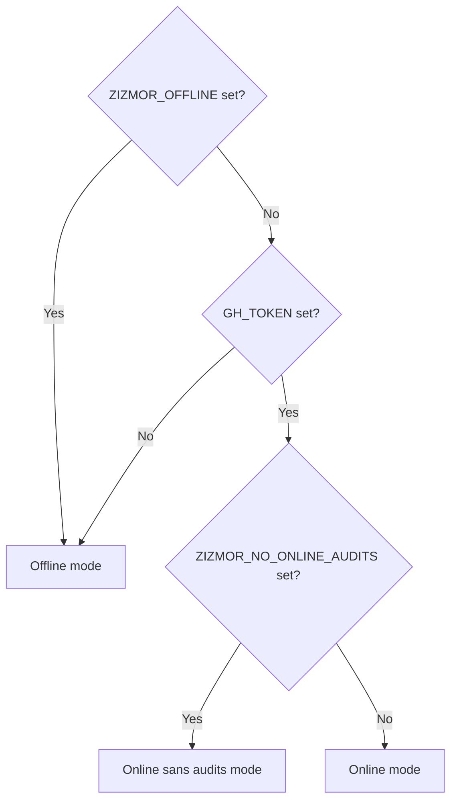

# Usage

## Input collection

Before auditing, `zizmor` performs an input collection phase.

There are three input sources that `zizmor` knows about:

1. Individual workflow and composite action files, e.g. `foo.yml` and
   `my-action/action.yml`;
2. "Local" GitHub repositories in the form of a directory, e.g. `my-repo/`;
3. "Remote" GitHub repositories in the form of a "slug", e.g.
   `pypa/sampleproject`.

    !!! tip

        By default, a remote repository will be audited from the `HEAD`
        of the default branch. To control this, you can append a `git`
        reference to the slug:

        ```bash
        # audit at HEAD on the default branch
        zizmor example/example

        # audit at branch or tag `v1`
        zizmor example/example@v1

        # audit at a specific SHA
        zizmor example/example@abababab...
        ```

    !!! tip

        Remote auditing requires Internet access and a GitHub API token.
        See [Operating Modes](#operating-modes) and
        [GitHub API token permissions](#github-api-token-permissions) for more
        information.

`zizmor` can audit multiple inputs in the same run, and different input
sources can be mixed and matched:

```bash
# audit a single local workflow, an entire local directory, and
# a remote repository all in the same run
zizmor ../example.yml ../other-repo/ example/example
```

When auditing local directories and/or remote repositories, `zizmor` will
collect all known input kinds by default. To configure collection behavior,
you can use the `--collect=...` option.

```bash
# collect everything regardless of `.gitignore` patterns
zizmor --collect=all example/example

# collect everything while respecting `.gitignore` patterns (the default)
zizmor --collect=default example/example

# collect only workflows
zizmor --collect=workflows example/example

# collect only actions
zizmor --collect=actions example/example

# collect only Dependabot configs
zizmor --collect=dependabot example/example

# collect only workflows and actions (not Dependabot configs)
zizmor --collect=workflows,actions example/example
```

!!! warning "Deprecation"

  `--collect=workflows-only` and `--collect=actions-only` are
  deprecated aliases for `--collect=workflows` and
  `--collect=actions`, respectively, as of `v1.15.0`.

  Users should switch to the non-deprecated forms, as the deprecated
  forms will be removed in a future release.

!!! tip

    `--collect=all` can be significantly slower than `--collect=default`,
    particularly when collecting from directories that contain large
    hierarchies of paths that would be ignored by `.gitignore` patterns.

!!! tip

    `--collect=...` only controls input collection from repository input
    sources. In other words, `zizmor --collect=actions workflow.yml`
    *will* audit `workflow.yml`, since it was passed explicitly and not
    collected indirectly.

By default, `zizmor` will warn (but not fail) if it fails to parse an
input file. To turn these warnings into failures,
you can use the `--strict-collection` option:

```bash
# fail if any files collected from example/example fail to parse
zizmor --strict-collection example/example
```

!!! important

    `--strict-collection` is available in `v1.7.0` and later.

## Operating Modes

`zizmor` has three *operating modes*:

* **Offline**: `zizmor` will not access the Internet,
  will not fetch remote repositories, and will not perform
  any audits that require online access (e.g. to the GitHub API).
* **Online**: `zizmor` will fetch remote repositories
  as necessary, and will perform all audits that require
  online access.
* **Online sans audits**: `zizmor` will fetch remote repositories
  as necessary, but will skip any audits that require online access.

`zizmor` attempts to select a default operating mode based on the user's
environment:

- If `ZIZMOR_OFFLINE` is set, then `zizmor` runs in offline mode.
- If `GH_TOKEN` is set, then `zizmor` runs in online mode with audits.
    - Additionally `ZIZMOR_NO_ONLINE_AUDITS` is set, then `zizmor` runs
      online sans audits.
- If neither `ZIZMOR_OFFLINE` nor `GH_TOKEN` are set, then `zizmor` runs
  in offline mode.

Or, as a flowchart:



Each operating mode can also be made explicit through command-line flags:

```bash
# force offline, even if a GH_TOKEN is present
# this disables all online actions, including repository fetches
zizmor --offline workflow.yml

# passing a token explicitly will enable online mode
# in this case, we use the `gh` CLI token
zizmor --gh-token $(gh auth token) workflow.yml

# online for the purpose of fetching the input (example/example),
# but all audits themselves are offline
zizmor --no-online-audits --gh-token $(gh auth token) example/example
```

### GitHub API token permissions

!!! tip

    If you're running `zizmor` locally with an online mode, it is
    **strongly recommended** that you use `gh auth token` from the [GitHub CLI]
    to automatically access an API token and avoid error-prone manual
    provisioning.

    This token is almost always pre-configured with sufficient permissions,
    meaning that you **do not** need any of the manual steps below.

    [GitHub CLI]: https://cli.github.com/

When running in an online mode, `zizmor` uses the GitHub API for
various operations, including fetching a repository's contents
(for the collection phase) and fetching tag/branch/commit histories
(for the auditing phase).

Generally speaking, `zizmor` does **not** require any special permissions
from its GitHub API token: it uses the token *primarily* to provide
authentication for rate-limited API requests.

However, if you are auditing a private remote repository (e.g.
`zizmor myorg/private-repo`) or auditing _any_ input that contains
private references (e.g. `#!yaml uses: myorg/private-action`), then
you may need to provision permissions for the token:

- `#!yaml contents: read` for GitHub Actions
- `repo` for OAuth tokens and "classic" PATs
- An appropriate repository access scope for fine-grained PATs

In addition to these permissions, some integrations of `zizmor`
(like GitHub Advanced Security) may require additional permissions
in the context of GitHub Actions. See
[Integration - GitHub Actions](./integrations.md#github-actions) for more details.

## Output formats

`zizmor` always produces output on `stdout`.

### Cargo-style output ("plain")

By default, `zizmor` produces `cargo`-style diagnostic output.

```console
error[template-injection]: code injection via template expansion
  --> ./tests/integration/test-data/template-injection/pr-425-backstop/action.yml:31:56
   |
29 |       uses: azure/powershell@whatever
   |       ------------------------------- action accepts arbitrary code
30 |       with:
31 |         inlineScript: Get-AzVM -ResourceGroupName "${{ inputs.expandme }}"
   |         ------------ via this input                    ^^^^^^^^^^^^^^^ may expand into attacker-controllable code
   |
   = note: audit confidence → High
```

This output will be colorized by default when sent to a supporting terminal and
uncolorized by default when piped to another program. Users can also explicitly
disable output colorization by setting `NO_COLOR=1` in their environment.

This format can also be explicitly selected with `--format=plain`.

#### Audit documentation links

By default, `zizmor` includes links to relevant documentation pages
for each finding in its plain output format. These links are provided via
[OSC 8](https://gist.github.com/egmontkob/eb114294efbcd5adb1944c9f3cb5feda)
hyperlinks, which are supported by many modern terminal emulators.

For example, in the output above, `template-injection` within
`error[template-injection]: ...` is a clickable link that takes you to
the [template-injection](./audits#template-injection) audit documentation.

In addition to these OSC 8 links, `zizmor` also includes the full URL
as part of each finding _if_ it detects a non-terminal output _or_
a CI environment (e.g. GitHub Actions).

To make this behavior explicir, users can supply the `--show-audit-urls`
option:

```bash
# always show audit documentation URLs, even if output is to a terminal
zizmor --show-audit-urls=always ...

# never show audit documentation URLs
zizmor --show-audit-urls=never ... 
```

!!! note

    `--show-audit-urls=...` is available in `v1.19.0` and later.

#### Color customization

When invoked from a terminal, `zizmor` will attempt to enrich its output
with ANSI colors.

!!! note

    `--color` is available in `v1.5.0` and later.

Some users may prefer to explicitly enable or disable this behavior. For
example, GitHub Actions is not a terminal but it does support ANSI colors,
so enabling colors in GitHub Actions can make logs more readable.

To explicitly control `zizmor`'s colorization behavior, use the
`--color` option:

```bash
# force colorization
zizmor --color=always ...

# force no colorization
zizmor --color=never ...
```

`zizmor` also respects various environment variables for colorization:

* [`NO_COLOR`](https://no-color.org/): if set to any value, disables colorization
* [`FORCE_COLOR`](https://force-color.org/): if set to any value, enables colorization
* [`CLICOLOR_FORCE`](https://bixense.com/clicolors/): if set to any value, enables colorization

### JSON

!!! important

    The JSON format is versioned, and `--format=json` is an alias for the
    current version.

    The current version of the JSON format is `v1`. You can use
    `--format=json-v1` to explicitly select the current version.

    The following compatibility policy is used for JSON format versions:

    1. The current version of the format is always aliased as `json`.
    2. When a new version of the JSON format is added, `--format=json`
       will show a deprecation warning, and will transition to the new version
       with the next major release.
    3. When a new version of the JSON format is added, explicit uses of the
       old version will show a deprecation warning.
    4. The old version will be removed in the *subsequent* major release
       (i.e., the major release after the one that transitions the `json` alias).

!!! important

    `--format=json-v1` is available in `v1.6.0` and later.

!!! important

    `--format=json-v1` uses 0-based line numbering, where line numbers are
    denoted by the key `row`. This is as opposed to `--format=plain` and `--format=SARIF`,
    where line numbers are 1-based.

With `--format=json`, `zizmor` will produce a flat array of findings in
JSON format:

```bash
zizmor --format=json . | jq .[0]
```

??? Example "Example output"

    ```json
    {
      "ident": "github-env",
      "desc": "dangerous use of environment file",
      "url": "https://docs.zizmor.sh/audits/#github-env",
      "determinations": {
        "confidence": "Low",
        "severity": "High",
        "persona": "Regular"
      },
      "locations": [
        {
          "symbolic": {
            "key": {
              "Local": {
                "prefix": ".",
                "given_path": "./tests/integration/test-data/github-env/action.yml"
              }
            },
            "annotation": "write to GITHUB_ENV may allow code execution",
            "route": {
              "components": [
                {
                  "Key": "runs"
                },
                {
                  "Key": "steps"
                },
                {
                  "Index": 0
                },
                {
                  "Key": "run"
                }
              ]
            },
            "kind": "Primary"
          },
          "concrete": {
            "location": {
              "start_point": {
                "row": 9,
                "column": 6
              },
              "end_point": {
                "row": 10,
                "column": 40
              },
              "offset_span": {
                "start": 202,
                "end": 249
              }
            },
            "feature": "      run: |\n        echo \"foo=$(bar)\" >> $GITHUB_ENV",
            "comments": []
          }
        }
      ],
      "ignored": false
    }
    ```

### SARIF

`zizmor` supports SARIF via `--format=sarif`.
SARIF is a JSON-based standard for representing static analysis results.

See [Integration - GitHub Actions](./integrations.md#github-actions) for
information on using `zizmor` with GitHub's Advanced Security
functionality via GitHub Actions.

### GitHub Annotations

!!! note

    `--format=github` is available in `v1.6.0` and later.

`zizmor` supports GitHub annotations via `--format=github`.

See [Workflow Commands for GitHub Actions] for additional information about
annotations.

[Workflow Commands for GitHub Actions]: https://docs.github.com/en/actions/reference/workflows-and-actions/workflow-commands

!!! warning

    GitHub annotations come with significant limitations: a single CI step
    can only render 10 annotations at a time.

    If your `zizmor` run produces more than 10 findings, only the first 10 will
    be rendered; all subsequent findings will be logged in the actions log but
    **will not be rendered** as annotations.

    See orgs/community?26680 and orgs/community?68471 for additional
    information.


## Exit codes

`zizmor` will exit with a variety of exit codes, depending on how
you invoke it and what happens during the run. In general:

| Code | Meaning |
| ---- | ------- |
| 0    | Successful audit; no findings to report (or SARIF mode enabled). |
| 1    | Error during audit; consult output. |
| 2    | Argument parsing failure; consult output. |
| 11   | One or more findings found; highest finding is "informational" level. |
| 12   | One or more findings found; highest finding is "low" level. |
| 13   | One or more findings found; highest finding is "medium" level. |
| 14   | One or more findings found; highest finding is "high" level. |

All other exit codes are currently reserved.

!!! warning "Removal"

    Versions of zizmor prior to `v1.14.0` used exit code `10` to indicate
    the highest finding having "unknown" severity. This exit code is
    no longer used as of `v1.14.0`.

Beyond this general table, the following modes of operation also
change the exit code behavior:

* If you run with `--no-exit-codes`, `zizmor` will **not** use exit codes 11
  and above.
* If you use `--format=sarif`, `zizmor` will **not** use exit codes 11 and
  above.

    !!! tip "Why?"

        Because SARIF consumers generally don't expect SARIF producers
        (like `zizmor`) to exit with a non-zero code *except* in the case
        of an internal failure. SARIF consumers expect semantic results
        to be communicated within the SARIF itself.

* If you run with `--fix` *and* all findings are successfully auto-fixed,
  `zizmor` will **not** use exit codes 11 and above.

    !!! tip "Why?"

        Because the higher exit codes indicate that action needs to be taken,
        but a successful application of all fixes means that no action
        is required.

## Using personas

!!! tip

    `--persona=...` is available in `v0.7.0` and later.

`zizmor` comes with three pre-defined "personas," which dictate how
sensitive `zizmor`'s analyses are:

* The _regular persona_: the user wants high-signal, low-noise, actionable
  security findings. This persona is best for ordinary local use as well as use
  in most CI/CD setups, which is why it's the default.

    !!! note

        This persona can be made explicit with `--persona=regular`,
        although this is not required.


* The _pedantic persona_, enabled with `--persona=pedantic`: the user wants
  *code smells* in addition to regular, actionable security findings.

    This persona is ideal for finding things that are a good idea
    to clean up or resolve, but are likely not immediately actionable
    security findings (or are actionable, but suggest a intentional
    security decision by the workflow/action author).

    For example, using the pedantic persona will flag the following
    with an `unpinned-uses` finding, since it uses a symbolic reference
    as its pin instead of a hashed pin:

    ```yaml
    uses: actions/checkout@v3
    ```

    produces:

    ```console
    $ zizmor --pedantic tests/test-data/unpinned-uses.yml
    help[unpinned-uses]: unpinned action reference
      --> tests/test-data/unpinned-uses.yml:14:9
       |
    14 |       - uses: actions/checkout@v3
       |         ------------------------- help: action is not pinned to a hash ref
       |
       = note: audit confidence → High
    ```

    !!! tip

        This persona can also be enabled with `--pedantic`, which is
        an alias for `--persona=pedantic`.

* The _auditor persona_, enabled with `--persona=auditor`: the user wants
  *everything* flagged by `zizmor`, including findings that are likely
  to be false positives.

    This persona is ideal for security auditors and code reviewers, who
    want to go through `zizmor`'s findings manually with a fine-toothed comb.

!!! tip

    Some audits, notably [`self-hosted-runner`](./audits.md#self-hosted-runner),
    *only* produce auditor-level results. This is because these audits require
    runtime context that `zizmor` lacks access to by design, meaning that their
    results are always subject to false positives.

    For example, with the default persona:

    ```console
    $ zizmor self-hosted.yml
    🌈 completed self-hosted.yml
    No findings to report. Good job! (1 suppressed)
    ```

    and with `--persona=auditor`:

    ```console
    $ zizmor --persona=auditor self-hosted.yml
    warning[self-hosted-runner]: runs on a self-hosted runner
      --> self-hosted.yml:13:5
       |
    13 |     runs-on: [self-hosted, my-ubuntu-box]
       |     ^^^^^^^^^^^^^^^^^^^^^^^^^^^^^^^^^^^^^ self-hosted runner used here
       |
       = note: audit confidence → High

    1 finding: 0 informational, 0 low, 1 medium, 0 high
    ```

## Auto-fixing results { #auto-fixing-results }

!!! tip

    `--fix=[MODE]` is available in `v1.10.0` and later, and is
    considered stable as of `v1.15.0`.

Starting with `v1.10.0`, `zizmor` can automatically fix a subset of its findings.

Auto-fixable findings are marked with an additional `note:` annotation
beneath their body, e.g.:

```console hl_lines="10"
error[template-injection]: code injection via template expansion
  --> example.yml:18:36
   |
17 |       - run: |
   |         ^^^ this run block
18 |           echo "doing a thing: ${{ inputs.test }}"
   |                                    ^^^^^^^^^^^ may expand into attacker-controllable code
   |
   = note: audit confidence → High
   = note: this finding has an auto-fix
```

To attempt auto-fixes for *safe* fixes, you can use the `--fix` or
`--fix=safe` option:

```bash
# these two are equivalent
zizmor --fix example.yml
zizmor --fix=safe example.yml
```

### Unsafe fixes

!!! important

    Unsafe fixes **must** be manually reviewed for semantic correctness.

By default, `--fix` will only apply *safe* fixes, i.e. fixes that are
safe to apply with minimal human oversight due to their low breakage risk.

Not all changes are safe, however, and `zizmor` offers *unsafe* fixes
for some findings as well. These fixes are *often* correct, but require
human review.

To apply *unsafe* fixes, you can either use `--fix=all` (to enable both
safe and unsafe fixes) or `--fix=unsafe-only` (to enable only unsafe fixes):

```bash
zizmor --fix=all example.yml
zizmor --fix=unsafe-only example.yml
```

### Limitations

`zizmor`'s auto-fix mode has several limitations that are important
to keep in mind:

* **In-place modification**: `--fix=[MODE]` modifies fixable inputs
  in-place, meaning that the original files will be modified.
* **No remote fixes**: as a corollary to the above, `--fix=[MODE]`
  does not support remote inputs (e.g. `zizmor example/example`).
* **Format preservation**: `--fix=[MODE]` attempts to preserve
  the original format of the input files, including exact indentation
  and comments. However, this is ultimately a heuristic, and
  some patches may not match the file's exact style.

## Filtering results

There are two straightforward ways to filter `zizmor`'s results:

1. If all you need is severity or confidence filtering (e.g. "I want only
   medium-severity and/or medium-confidence and above results"), then you can use
   the `--min-severity` and `--min-confidence` flags:

    !!! tip

        `--min-severity` and `--min-confidence` are available in `v0.6.0` and later.

    !!! warning "Deprecation"

        `--min-severity=unknown` and `--min-confidence=unknown` are
        **deprecated** as of `v1.14.0` and will be removed in a future release.
        Users should omit these entirely, as they were no-ops even prior to
        deprecation.

     ```bash
     # filter informational, and low findings with low confidence
     zizmor --min-severity=medium --min-confidence=medium ...
     ```

2. If you need more advanced filtering (with nontrivial conditions or
   state considerations), then consider using `--format=json` and using
   `jq` (or a script) to perform your filtering.

     As a starting point, here's how you can use `jq` to filter `zizmor`'s
     JSON output to only results that are marked as "high confidence":

     ```bash
     zizmor --format=json-v1 ... | jq 'map(select(.determinations.confidence == "High"))'
     ```

## Ignoring results

`zizmor`'s defaults are not always 100% right for every possible use case.

If you find that `zizmor` produces findings that aren't right for you
(and **aren't** false positives, which should be reported!), then you can
choose to *selectively ignore* results via either special ignore comments
*or* a `zizmor.yml` configuration file.

### With comments

!!! note

    Ignore comment support was added in `v0.6.0`.

Findings can be ignored inline with `# zizmor: ignore[rulename]` comments.
This is ideal for one-off ignores, where a whole `zizmor.yml` configuration
file would be too heavyweight.

Multiple different audits can be ignored with a single comment by
separating each rule with a comma, e.g.
`# zizmor: ignore[artipacked,ref-confusion]`.

To ignore a single `template-injection` finding:

```yaml title="example.yml"
run: | # zizmor: ignore[template-injection]
  echo "${{ github.event.issue.title }}"
```

Ignore comments can also have a trailing explanation:

```yaml title="example.yml"
run: | # zizmor: ignore[template-injection] i promise this is safe
  echo "${{ github.event.issue.title }}"
```

!!! important

    An ignore comment can be placed anywhere in any span identified by a finding,
    **so long** as it can be identified as a YAML comment. In particular,
    this means that you **can't** place an ignore comment in the middle of a string
    or a block literal. For example, the following does not work:

    ```yaml title="example.yml"
    # this is not suppressed, since the comment is actually part of the string
    run: |
      echo "${{ github.event.issue.title }}" # zizmor: ignore[template-injection]
    ```

    To fix this, you should place the ignore comment outside of the string,
    e.g. directly above it:

    ```yaml title="example.yml"
    run: | # zizmor: ignore[template-injection]
      echo "${{ github.event.issue.title }}"
    ```

### With `zizmor.yml`

When ignoring multiple findings (or entire files), a `zizmor.yml` configuration
file is easier to maintain than one-off comments.

Here's what a `zizmor.yml` file might look like:

```yaml title="zizmor.yml"
rules:
  template-injection:
    ignore:
      - safe.yml
      - somewhat-safe.yml:123
      - one-exact-spot.yml:123:456
```

Concretely, this `zizmor.yml` configuration declares three ignore rules,
all for the [`template-injection`](./audits.md#template-injection) audit:

1. Ignore all findings in `safe.yml`, regardless of line/column location
2. Ignore *any* findings in `somewhat-safe.yml` that occur on line 123
3. Ignore *one* finding in `one-exact-spot.yml` that occurs on line 123, column 456

More generally, the filename ignore syntax is `workflow.yml:line:col`, where
`line` and `col` are both optional and 1-based (meaning `foo.yml:1:1`
is the start of the file, not `foo.yml:0:0`).

To pass a configuration to `zizmor`, you can either place `zizmor.yml`
somewhere where `zizmor` [will discover it], or pass it explicitly via
the `--config` argument. With `--config`, the file can be named anything:

```bash
zizmor --config my-zizmor-config.yml /dir/to/audit
```

!!! important

    When using `--config`, only a single configuration file is used
    (instead of potentially discovering multiple configuration files,
    one per input source). As a result, using `--config` is
    **generally not recommended** unless auditing a single input source
    (file, directory, or remote repository).

!!! tip

    Starting with `v1.8.0`, you can use the `ZIZMOR_CONFIG` environment
    variable to specify a configuration file.

    `ZIZMOR_CONFIG=my-config.yml` is equivalent to
    `--config my-config.yml`.

[will discover it]: ./configuration.md#discovery

See [Configuration: `rules.<id>.ignore`](./configuration.md#rulesidignore) for
more details on writing ignore rules.

## Caching between runs

!!! tip

    Persistent caching (between runs of `zizmor`) is available in `v0.10.0` and later.

!!! warning

    Caches can contain sensitive metadata, especially when auditing private
    repositories! Think twice before sharing your cache or reusing
    it across machine/visibility boundaries.

`zizmor` caches HTTP responses from GitHub's REST APIs to speed up individual
audits. This HTTP cache is persisted and re-used between runs as well.

By default `zizmor` will cache to an appropriate user-level caching directory:

* Linux and macOS: `$XDG_CACHE_DIR` (`~/.cache/zizmor` by default)
* Windows: `~\AppData\Roaming\woodruffw\zizmor`.

To override the default caching directory, pass `--cache-dir`:

```bash
# cache in /tmp instead
zizmor --cache-dir /tmp/zizmor ...
```

## Other GitHub hosts

!!! warning

    Support for custom GitHub Enterprise instances is provided on a **best-effort**
    basis. If you're a corporate user of `zizmor` who is interested in improving
    `zizmor`'s GitHub Enterprise support, please
    [let us know](https://github.com/zizmorcore/zizmor/issues/new)
    and [consider sponsoring](./index.md#sponsoring) development in this area!

`zizmor` supports GitHub instances other than `github.com`.

To use it with your [GitHub Enterprise](https://github.com/enterprise) instance
(either cloud or self-hosted), pass your instance's domain with `--gh-hostname`
or `GH_HOST`:

```bash
zizmor --gh-hostname custom.example.com ...

# or, with GH_HOST
GH_HOST=custom.ghe.com zizmor ...
```

## Limitations

`zizmor` can help you write more secure GitHub workflow and action definitions,
as well as help you find exploitable bugs in existing definitions.

However, like all tools, `zizmor` is **not a panacea**, and has
fundamental limitations that must be kept in mind. This page
documents some of those limitations.

### `zizmor` is a _static_ analysis tool { #static-analysis }

`zizmor` is a _static_ analysis tool. It never executes any code, nor does it
have access to any runtime state.

In contrast, GitHub Actions workflow and action definitions are highly
dynamic, and can be influenced by inputs that can only be inspected at
runtime.

For example, here is a workflow where a job's matrix is generated
at runtime by a previous job, making the matrix impossible to
analyze statically:

```yaml
build-matrix:
  name: Build the matrix
  runs-on: ubuntu-latest
  outputs:
    matrix: ${{ steps.set-matrix.outputs.matrix }}
  steps:
    - id: set-matrix
      run: |
        echo "matrix=$(python generate_matrix.py)" >> "${GITHUB_OUTPUT}"

run:
  name: ${{ matrix.name }}
  needs:
    - build-matrix
  runs-on: ubuntu-latest
  strategy:
    matrix: ${{ fromJson(needs.build-matrix.outputs.matrix) }}
  steps:
    - run: |
        echo "hello ${{ matrix.something }}"
```

In the above, the expansion of `${{ matrix.something }}` is entirely controlled
by the output of `generate_matrix.py`, which is only known at runtime.

In such cases, `zizmor` will err on the side of verbosity. For example,
the [template-injection](./audits.md#template-injection) audit will flag
`${{ matrix.something }}` as a potential code injection risk, since it
can't infer anything about what `matrix.something` might expand to.

### `zizmor` audits workflow and action _definitions_ only { #definitions-only }

`zizmor` audits workflow and action _definitions_ only. That means the
contents of `foo.yml` (for your workflow definitions) or `action.yml` (for your
composite action definitions).

In practice, this means that `zizmor` does **not** analyze other files
referenced by workflow and action definitions. For example:

```yaml
example:
  runs-on: ubuntu-latest
  steps:
    - name: step-1
      run: |
        echo foo=$(bar) >> $GITHUB_ENV

    - name: step-2
      run: |
        # some-script.sh contains the same code as step-1
        ./some-script.sh
```

`zizmor` can analyze `step-1` above, because the code it executes
is present within the workflow definition itself. It *cannot* analyze
`step-2` beyond the presence of a script execution, since it doesn't
audit shell scripts or any other kind of files.

More generally, `zizmor` cannot analyze files indirectly referenced within
workflow/action definitions, as they may not actually exist until runtime.
For example, `some-script.sh` above may have been generated or downloaded
outside of any repository-tracked state.

### YAML anchors stymie analysis { #yaml-anchors }

!!! tip "TL;DR"

    `zizmor`'s support for YAML anchors is provided on a **best effort**
    basis. Users of `zizmor` are **strongly encouraged** to avoid anchors
    if they care about accurate static analysis results.

`zizmor` tries very hard to present *useful* source spans in its audit
results.

To do this, `zizmor` needs to know a lot of about the inner workings
of the YAML serialization format that GitHub Actions workflows, action
definitions, and Dependabot files are expressed in.

YAML is a complicated serialization format, but GitHub *mostly* uses
a tractable subset of it. One conspicuous exception to this is
[YAML anchors](https://yaml.org/spec/1.2.2/#3222-anchors-and-aliases),
which GitHub has
[decided to support](https://github.blog/changelog/2025-09-18-actions-yaml-anchors-and-non-public-workflow-templates/)
in workflow and action definitions as of September 2025.

Anchors make `zizmor`'s analysis job *much* harder, as they introduce a
layer of (arbitrarily deep) indirection and misalignment between the
deserialized object model (which is what `zizmor` analyzes) and the source
representation (which `zizmor` spans back to).

As a result, `zizmor`'s support for YAML anchors is **best effort only**.
Users are **strongly encouraged** to avoid anchors in their workflows
and actions. Bug reports for issues in inputs containing anchors are
appreciated, but will be given a lower priority relative to bugs that
aren't observed with YAML anchors.

If you're having issues with inputs containing anchors, see
[Troubleshooting - Failures on inputs containing YAML anchors]
for some suggested workarounds.

[Troubleshooting - Failures on inputs containing YAML anchors]: ./troubleshooting.md#failures-on-inputs-containing-yaml-anchors
